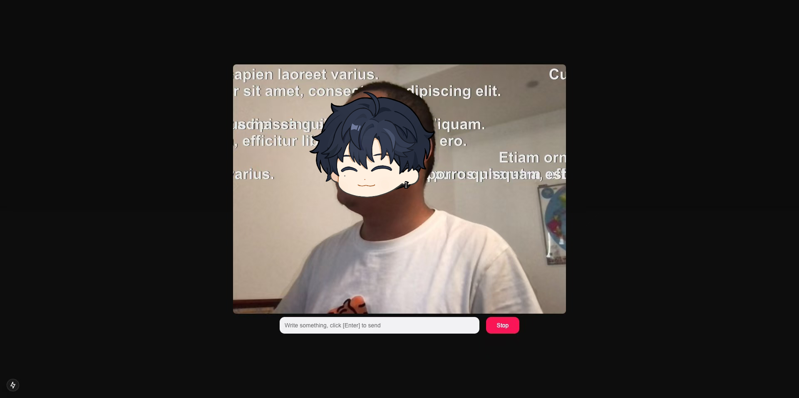

# Danmaku Mask


基于 Next.js 和 [Mediapipe](https://ai.google.dev/edge/mediapipe/solutions/guide) 实现的模拟 Bilibili 实时防挡脸弹幕效果。

A simulation of Bilibili's real-time face-masked danmaku barrage effect based on Next.js and Mediapipe.

| Bilibili                          | Danmaku Mask                   |
| --------------------------------- | ------------------------------ |
|  |  |

## Getting Started

```sh
npm i

npm run dev
```
